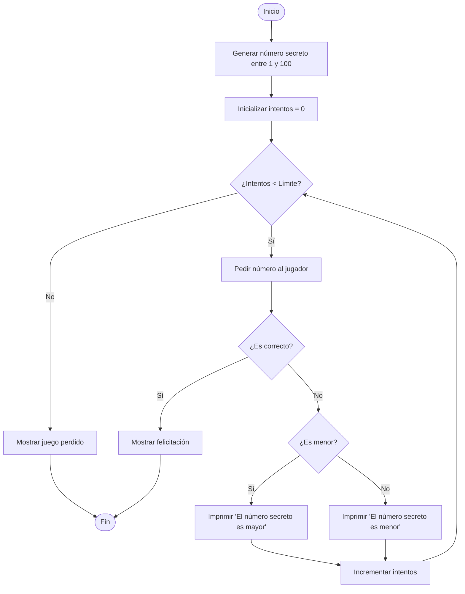

# Lección 10: Proyectos Prácticos Básicos (Integración)

Esta lección de cierre está dedicada a integrar todos los conceptos abordados a lo largo del curso (variables, condicionales, ciclos, funciones, manejo de excepciones e importación de librerías) en dos proyectos prácticos interactivos.

---

## 🎯 Objetivos de Aprendizaje
Al finalizar esta lección, serás capaz de:
1. **Estructurar** programas interactivos basados en consolas uniendo múltiples funciones especializadas.
2. **Validar** entradas de datos ingresadas por usuarios para prevenir fallas operativas (ej. división por cero).
3. **Utilizar** loops infinitos controlados (`while True`) para dar continuidad a la interfaz del usuario hasta que este elija salir.
4. **Implementar** librerías estándar en soluciones reales (como generación de números aleatorios para lógica de juegos).

---

## 💻 Descripción de los Proyectos Integradores

### 1. Proyecto 1: Calculadora Interactiva Básica
El objetivo de este proyecto es construir una herramienta de cálculo de operaciones aritméticas estándar desde consola.

#### Arquitectura del Programa
El script está estructurado bajo diseño modular, donde cada operación matemática reside en su propia función pura. Esto facilita la adición de operaciones científicas o complejas en el futuro:

```text
Calculadora
├── suma(num1, num2)             --> Retorna suma
├── resta(num1, num2)            --> Retorna resta
├── multiplicacion(num1, num2)   --> Retorna producto
├── division(num1, num2)         --> Retorna cociente (con validación de divisor != 0)
└── calculadora()                --> Función controladora (menú y entrada de datos)
```

> [!NOTE]
> La función `calculadora()` controla el flujo principal. Despliega la interfaz del menú, solicita las entradas numéricas mediante `input()`, realiza el casteo a `float` y llama a la operación seleccionada aplicando una estructura condicional `if-elif-else`.

---

### 2. Proyecto 2: Juego de Adivinanza de Números
El objetivo consiste en desarrollar un juego interactivo de adivinanza de números en el que la computadora genera un número secreto aleatorio y el jugador intenta adivinarlo en una cantidad limitada de intentos, recibiendo pistas ("menor" o "mayor") en cada turno.

#### Lógica del Juego



* **Aleatoriedad:** Emplea el método `random.randint(1, 100)` para fijar la meta del juego en cada ejecución.
* **Control de Ciclos:** Utiliza un ciclo condicional `while` limitado por una constante `max_intentos = 10`. Si el usuario adivina, la instrucción `break` rompe el ciclo e informa la victoria.

---

## 🏋️ Desafíos de Expansión (Tu Proyecto de Curso)
Para obtener el máximo provecho de estos proyectos base, intenta aplicarles las siguientes mejoras localmente:

1. **Calculadora con Historial y Continuidad:** Modifica la calculadora para que:
   * Funcione dentro de un ciclo `while` para que el usuario pueda realizar múltiples cálculos consecutivos sin reiniciar el script. Agrega una opción de salida (ej. "5. Salir").
   * Almacene los resultados de las operaciones en una lista llamada `historial` y añade una opción en el menú para consultar las últimas consultas realizadas.
2. **Niveles de Dificultad para el Juego:** Expande el juego de adivinanzas añadiendo una selección inicial de dificultad:
   * **Fácil:** Rango de 1 a 50 con 10 intentos.
   * **Medio:** Rango de 1 a 100 con 7 intentos.
   * **Difícil:** Rango de 1 a 200 con 5 intentos.
3. **Resistencia a Fallos (Robustez):** Modifica ambos scripts para que, si el usuario introduce letras en lugar de números en el teclado, el programa no falle con un error de tipo `ValueError`. Implementa bloques `try-except` para solicitar el dato de nuevo hasta que sea un número válido.
