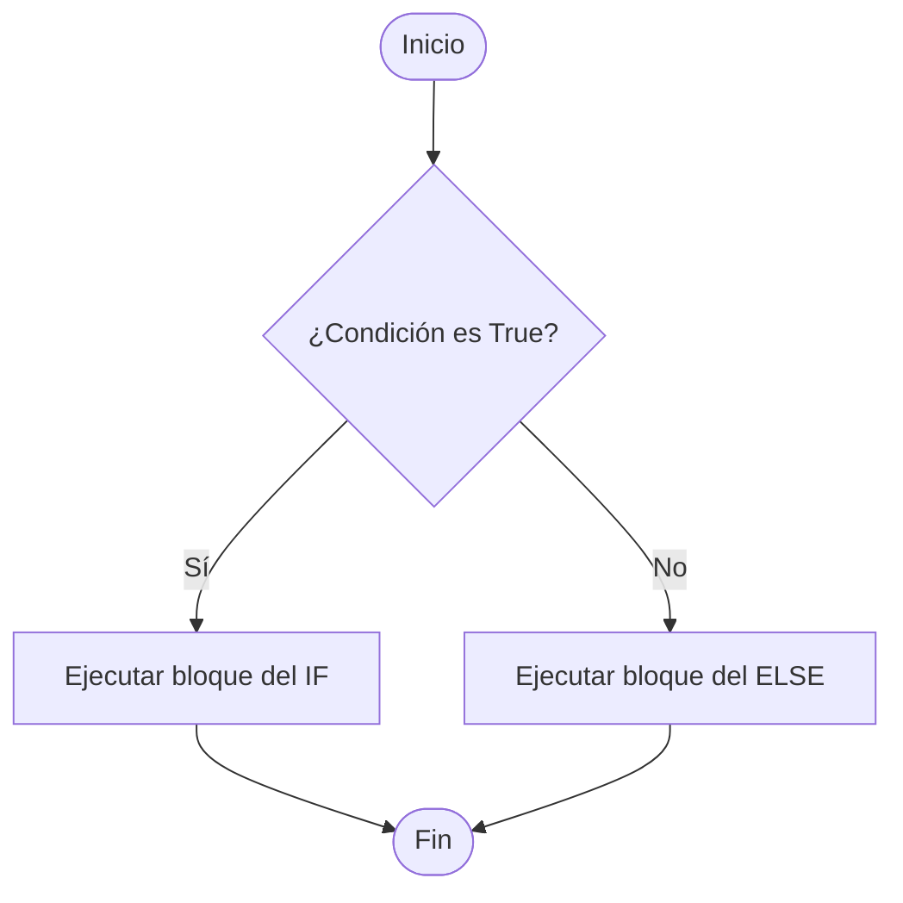
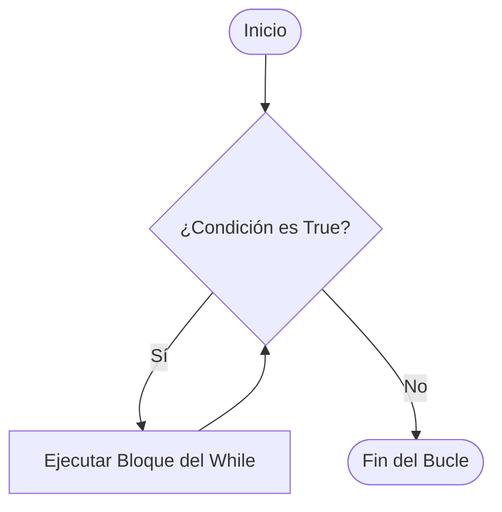

# Lección 3: Estructuras de Control (Condicionales y Ciclos)

Esta lección aborda el control del flujo de ejecución de tus programas. Aprenderás a tomar decisiones lógicas y a repetir tareas de manera eficiente mediante bucles.

---

## 🎯 Objetivos de Aprendizaje
Al finalizar esta lección, serás capaz de:
1. **Evaluar** expresiones condicionales usando `if`, `elif` y `else`.
2. **Implementar** bucles definidos con `for` y bucles condicionales con `while`.
3. **Controlar** el flujo interno de los bucles usando las sentencias `break` y `continue`.
4. **Comprender** la importancia de la indentación como delimitador de bloques en Python.

---

## 📖 Contenido Conceptual

### 1. Condicionales: Toma de Decisiones
Los condicionales evalúan una o más expresiones booleanas. Según el resultado (`True` o `False`), el flujo del programa tomará un camino u otro.

#### El Bloque `if-else`
El flujo básico de decisiones se puede representar visualmente de la siguiente manera:



* **`if`:** Evalúa la expresión inicial. Si es verdadera, ejecuta su bloque.
* **`elif` (abreviatura de *else if*):** Evalúa condiciones adicionales de forma secuencial si las anteriores fueron falsas.
* **`else`:** Se ejecuta opcionalmente cuando ninguna de las condiciones previas fue verdadera.

> [!IMPORTANT]
> **La Indentación en Python:** A diferencia de lenguajes que usan llaves `{}` para delimitar bloques de código, Python utiliza la **indentación** (sangría de 4 espacios por convención). Si no respetas la alineación, Python arrojará un error de tipo `IndentationError`.

---

### 2. Ciclos o Bucles: Repetición de Código

#### Ciclo `for`
El bucle `for` se utiliza para iterar sobre una secuencia predefinida (elementos de una lista, caracteres de una cadena o un rango numérico).

```python
for elemento in secuencia:
    # Código a repetir
```

> [!TIP]
> La función `range(inicio, fin, paso)` es de gran utilidad en ciclos `for`. Genera una secuencia de números enteros que comienza en `inicio` (por defecto 0), finaliza justo antes de `fin` (límite exclusivo) y avanza según el `paso` configurado.

#### Ciclo `while`
El bucle `while` repite un bloque de código mientras se cumpla una determinada condición lógica.



> [!WARNING]
> **Bucles Infinitos:** Si la condición de un bucle `while` nunca se vuelve falsa, el programa se ejecutará infinitamente y se colgará. Asegúrate de incluir instrucciones dentro del bucle que acerquen la condición hacia su finalización (como incrementar un contador).

---

### 3. Control de Ciclos: `break` y `continue`
* **`break`:** Interrumpe la ejecución del ciclo de manera inmediata y transfiere el flujo a la siguiente línea fuera del bucle.
* **`continue`:** Detiene la iteración actual y salta de inmediato a la siguiente comprobación de condición del ciclo.

---

## 📝 Resumen de la Lección
* Las bifurcaciones con `if`, `elif` y `else` desvían el flujo según la veracidad de condiciones.
* La indentación es obligatoria y define los límites de los bloques en Python.
* El ciclo `for` es ideal cuando conocemos de antemano el número de iteraciones (secuencias o rangos).
* El ciclo `while` repite el código según el estado de una condición que debe ser modificable.
* Las palabras clave `break` y `continue` otorgan un control granular de salida e iteración.

---

## 🏋️ Desafíos Prácticos
Prueba tus conocimientos diseñando y ejecutando los siguientes ejercicios:

1. **Clasificador de Calificaciones:** Escribe un script que solicite una nota numérica del 1 al 100. Imprime "Excelente" si es >= 90, "Bueno" si está entre 70 y 89, y "Reprobado" si es menor a 70.
2. **Sumatoria Dinámica:** Diseña un programa que pida números enteros al usuario y los sume acumulativamente. El programa debe detenerse inmediatamente cuando el usuario escriba el número `0` (utilizando `break`), mostrando la suma total.
3. **Filtrador de Pares:** Usa un ciclo `for` y la instrucción `continue` para imprimir todos los números impares que se encuentran entre el 1 y el 20.
